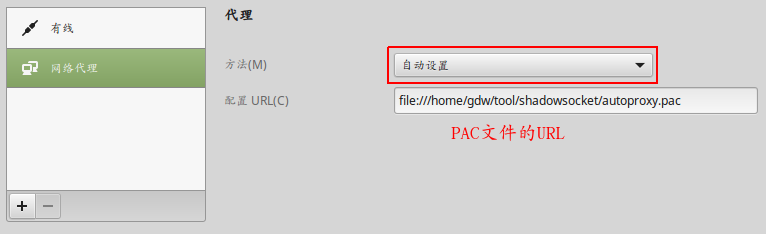
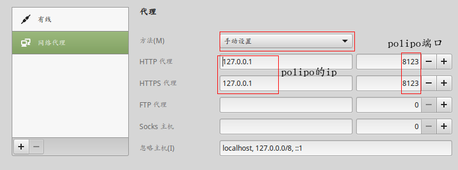
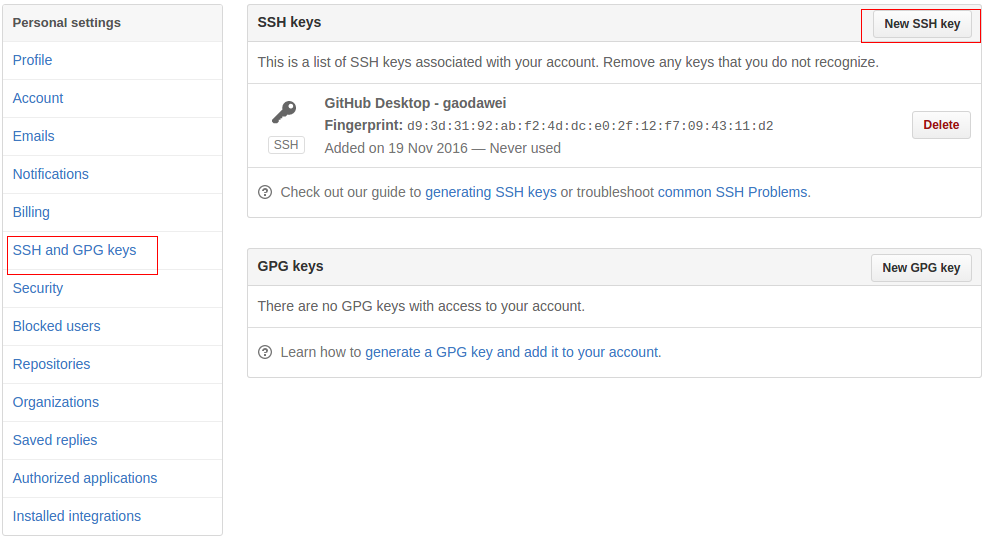

# 基本软件

## 安装搜狗输入法
- debian系列的，直接去官网下载安装包，安装即可。
- 对于fedora，可以直接去Fedora的中文社区中查找。
## 搭建上网环境

### 安装ShadowSocks Client

有两种安装方法：

- gui客户端：点击 [Shadowsocks GUI client](https://github.com/shadowsocks/shadowsocks-gui)查看安装信息
- command line 客户端：
  1. 安装python-pip：sudo apt-get install python-pip

  2. 安装Shadowsocs Client：pip install shadowsocks

  3. 配置

     ```json
     {
       "server": "服务器ip地址",
       "server_port": 端口,
       "password": "密码",
       "method": "rc4-md5",
     }
     ```

  4. 启动：sslocal -c /home/gdw/tool/shadowsocket/config.json -d start

  5. 将ShadowSocks开机自启动计划当中去

     将启动命令写成脚本，在将脚本启动命令加入到/etc/rc.local，末尾即可。


### pac局部代理

shadowsocks只有全局代理，所以我们要通过pac来进行局部代理。

1. 生产pac文件：

   1. 安装Genepac：sudo pip install genpac。它可以用来生成我们自己的PAC文件，同时它还支持获取gfwlist的时候设置代理。

   2. 为了方便管理生成的pac文件，我们在/home/目录下新建一个文件夹，命名为shadowsocks。

      ```shell
      mkdir ~/shadowsocks
      cd shadowsocks
      ```

   3. 命令生成pac文件

      ```shell
      genpac --proxy="SOCKS5 127.0.0.1:1080" -o autoproxy.pac --gfwlist-url="https://github.com/gfwlist/gfwlist/blob/master/gfwlist.txt"
      ```

2. 配置代理

   

   ​

### 安装Polipo

Shadowsocks默认是用Socks5协议的，对于Terminal的get,wget等走Http协议的地方是无能为力的，所以需要转换成Http代理，加强通用性，这里使用的转换方法是基于Polipo的。

1. 安装：apt-get install polipo

2. 配置：vi /etc/polipo/config

   新增如下配置

   ```
   proxyAddress = "0.0.0.0"
   proxyPort = 8123

   socksParentProxy = "localhost:1080"
   socksProxyType = socks5

   chunkHighMark = 50331648
   objectHighMark = 16384
   serverMaxSlots = 64 
   serverSlots = 16 
   serverSlots1 = 32
   ```

3. 重启：polipo

4. 测试

   ```shell
   export https_proxy="http://127.0.0.1:8123/"
   curl https://www.google.com
   ```

   如果正常，就会返回抓取到的Google网页内容。

5. 代理配置

   

PS：在浏览器中输入http://127.0.0.1:8123/便可以进入到Polipo的使用说明和配置界面。

### 安装chrome

去官网下载直接安装即可。

## 文本编辑器

### Typora Markdown

直接去[官网](https://www.typora.io/) 上即可找到安装过程。

### sublime

apt-get install sublime-text


## 终端工具

### guake

apt-get install guake

# 编程环境

## Java

### 安装oracle jdk

1. 下载并安装

2. 配置

   配置文件如下：

   - 只有某个用户用：用户home目录/.bashrc
   - 所有用户都能用：/etc/profile

   直接在配置文件 后面新增如下配置即可。

   ```shell
   export JAVA_HOME=JDK所在目录
   export PATH=$PATH:$HAVA_HOME/bin
   ```

### 安装ideaI

### 下载maven

### 下载gradle

### 环境配置

配置文件如下：

- 只有某个用户用：用户home目录/.bashrc，当完成修改后，注销用户即可生效
- 所有用户都能用：/etc/profile，当完成修改后，运行source /etc/profile即可生效

直接在配置文件 后面新增如下配置即可。

```shell
export JAVA_HOME=JDK所在目录
export MAVEN_HOME=maven所在目录
export GRADLE_HOME=gradle所在目录
export PATH=$PATH:$JAVA_HOME/bin:$MAVEN_HOME/bin:$GRADLE_HOME/bin
```


## git

### 安装

apt-get install git

### 链接githuab

1. 获取ssh秘钥

   ```shell
   $ cd ~/.ssh    //检查计算机ssh密钥
   ```

   如果没有提示:No such file or directory 说明你不是第一次使用git,执行下面的操作,清理原有ssh密钥。

   ```shell
   $ ls 
   config id_rsa id_rsa.pub known_hosts
   $ mkdir key_backup
   $ cp id_rsa* key_backup
   $ rm id_rsa*
   ```

   生成ssh秘钥	

   ```shell
   ssh-keygen -t rsa -C "defnngj@gmail.com"//填写email地址，然后一直“回车”ok
   ```

   打开本地..\.ssh\id_rsa.pub文件。此文件里面内容为刚才生成人密钥。

2. guthub配置

   登陆github系统，进入到个人设置-->SSH and GPG keys-->New SSH key

   

   把你本地生成的密钥复制到里面（key文本框中）， 点击 add key 就ok了。

3. 测试是否连接成功

   ```shell
   $ ssh -T git@github.com
   ```

   如果提示：Hi defnngj You've successfully authenticated, but GitHub does not provide shell access. 说明你连接成功了。

4. 设置用户信息

   ​